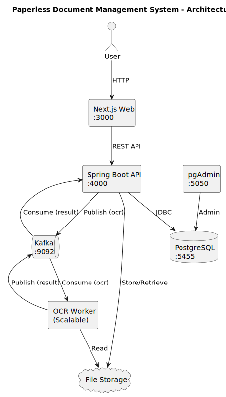

# SWEN3 Paperless Application

A Spring Boot application for document management with PostgreSQL database and pgAdmin interface.

## Architecture



The system follows a microservices architecture with the following components:

- **Next.js Web Frontend** (Port 3000): User interface for document management
- **Spring Boot REST API** (Port 4000): Backend API handling business logic
- **Gemini Summarization Service** (Port 4100): Accepts documents and returns Gemini-generated summaries
- **Kafka Message Queue** (Port 9092): Event streaming for OCR processing
- **OCR Worker**: Scalable workers for document text extraction
- **PostgreSQL Database** (Port 5455): Data persistence
- **pgAdmin** (Port 5050): Database administration interface
- **File Storage**: Document and file storage system

## Prerequisites

- Docker and Docker Compose installed on your system
- Git for cloning the repository

## Quick Start

### Build and Start the Application

```bash
# Build and start all services (database, app, pgAdmin)
docker compose up --build -d

# Or run in foreground to see logs
docker compose up --build --scale worker=3
```

### Access the Services

- **Spring Boot API**: http://localhost:8080
- **pgAdmin (Database Management)**: http://localhost:5050
  - Email: `admin@admin.com`
  - Password: `admin`
- **PostgreSQL Database**: localhost:5455 (from host machine)
- **Gemini Summarization Service**: http://localhost:4100/api/v1/summarize

### Gemini Service

- Set the `GEMINI_API_KEY` environment variable before starting `docker compose` so the service can reach the Gemini API. Optional overrides: `GEMINI_MODEL` (default `gemini-1.5-flash-latest`) and `GEMINI_ENDPOINT` (default Google v1beta endpoint).
- Example request:

```bash
curl -X POST http://localhost:4100/api/v1/summarize \
  -H "Content-Type: multipart/form-data" \
  -F "file=@/path/to/document.pdf"
```

The response is a JSON payload of the form `{"summary":"<gemini-generated-summary>"}`.

## Database Configuration

The application uses PostgreSQL with the following configuration:

- **Database Name**: `paperlessdb`
- **Username**: `paperless_user`
- **Password**: `paperless_pw`
- **Port**: 5455 (host) → 5432 (container)

## Testing and Code Coverage

### Running Tests

The project uses JUnit for testing and JaCoCo for code coverage analysis.

#### REST API Module

```bash
# Navigate to the REST API directory
cd apps/rest

# Run tests
mvnw test

# Run tests with code coverage report
mvnw clean test

# Generate coverage report without running tests again
mvnw jacoco:report
```

#### Worker Module

```bash
# Navigate to the worker directory
cd apps/worker

# Run tests
mvn test

# Run tests with code coverage report
mvn clean test

# Generate coverage report without running tests again
mvn jacoco:report
```

### Viewing Code Coverage Reports

After running tests, JaCoCo generates HTML reports that you can view in your browser:

- **REST API Coverage Report**: `apps/rest/target/site/jacoco/index.html`
- **Worker Coverage Report**: `apps/worker/target/site/jacoco/index.html`

Open these files in your web browser to see detailed coverage metrics including:

- Line coverage
- Branch coverage
- Method coverage
- Class coverage

### Code Coverage Thresholds

The project is configured with a minimum code coverage threshold of 50% at the package level. Builds will fail if coverage falls below this threshold.

To customize coverage thresholds, edit the JaCoCo plugin configuration in the respective `pom.xml` files.

### Running Coverage Check

To check if your code coverage meets the minimum threshold, you must first run tests to generate the coverage data:

```bash
# REST API - Run tests first, then check coverage
cd apps/rest
mvnw clean test
mvnw jacoco:check

# Or run both in one command
mvnw clean test jacoco:check

# Worker - Run tests first, then check coverage
cd apps/worker
mvn clean test
mvn jacoco:check

# Or run both in one command
mvn clean test jacoco:check
```

**Note**: The `jacoco:check` goal requires the coverage data file (`jacoco.exec`) which is generated during test execution. If you run `jacoco:check` without running tests first, it will skip the check.
